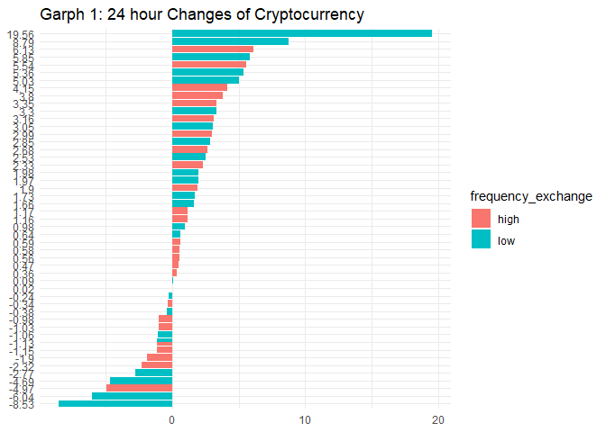
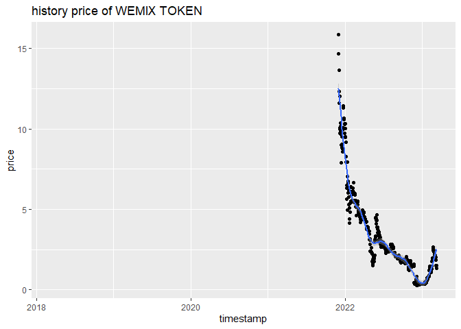
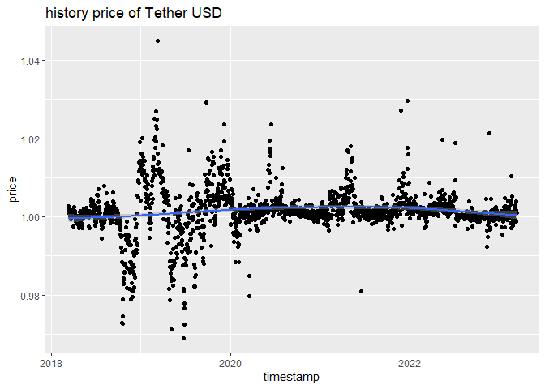
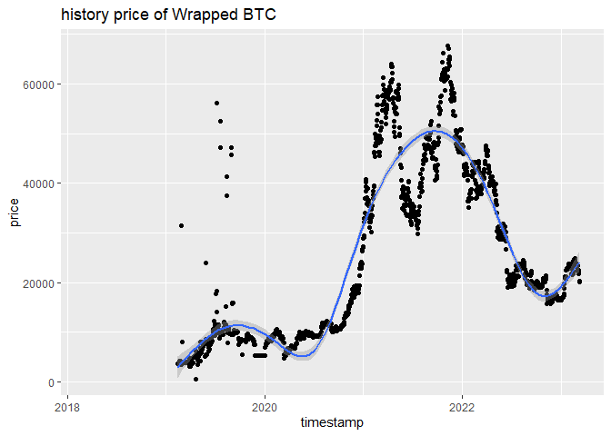
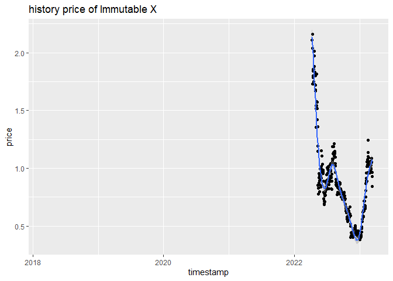
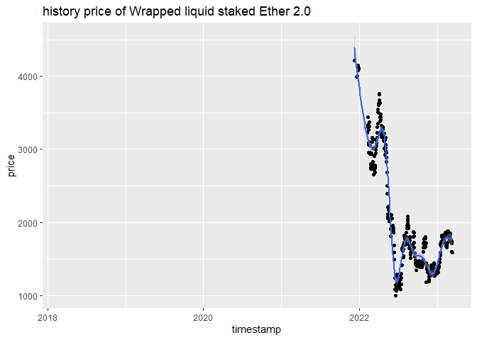
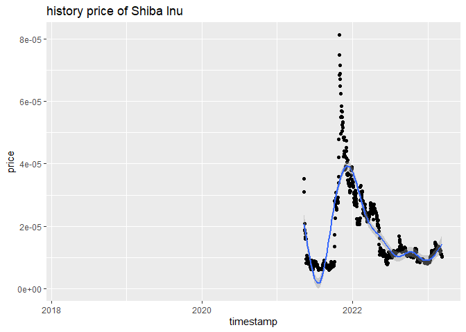

    ## 
    ## Attaching package: 'dplyr'

    ## The following objects are masked from 'package:stats':
    ## 
    ##     filter, lag

    ## The following objects are masked from 'package:base':
    ## 
    ##     intersect, setdiff, setequal, union

# Introduction

Cryptocurrency is a digital or virtual currency that uses cryptography
for security and operates independently of a central bank.
Cryptocurrencies are decentralized, meaning that they are not controlled
by a single authority or institution, but instead operate on a
distributed ledger system called blockchain.

The first and most well-known cryptocurrency is Bitcoin, which was
created in 2009 by an anonymous person or group of people using the
pseudonym Satoshi Nakamoto. Since then, many other cryptocurrencies have
been developed, including Ethereum, Litecoin, and Ripple.

Cryptocurrencies are created through a process called mining, which
involves using computational power to solve complex mathematical
problems and verify transactions on the blockchain. Transactions on the
blockchain are recorded in blocks, which are then added to the
blockchain in a chronological and immutable manner.

Now, cryptocurrency has become an increasingly important investment in
recent years, with many investors and traders looking to capitalize on
its price volatility and potential for high returns. However
cryptocurrencies, like any other investment, carry a number of risks
that investors should be aware of before investing. For example,
cryptocurrencies are known for their high volatility, with prices often
fluctuating significantly over short periods of time and the value of
cryptocurrencies depends on their adoption and use by individuals and
businesses. If adoption is low or slows down, the value of a
cryptocurrency may decrease or become worthless. Thus while they can
provide opportunities for high returns, investors should carefully
consider timing of buying or selling cryptocurrencies.

In this project, we will explore the historical price data of some
cryptocurrencies and try to gain insights into its price trends and
factors that may affect its price. We will use various statistical and
data visualization techniques to analyze the data and draw conclusions
about the cryptocurrency’s past and potential future performance.

To do this, we will collect general data and history price of
cryptocurrencies by Coinranking API and use various statistical and data
visualization techniques to analyze the data and draw conclusions about
the cryptocurrency’s past and potential future performance.

# Collect general data by API

At first, we need to extract general data including ids, names etc.

``` r
url <- "https://coinranking1.p.rapidapi.com/coins"

coin_query_string <- list(
  referenceCurrencyUuid = "yhjMzLPhuIDl",
  timePeriod = "24h",
  orderBy = "marketCap",
  orderDirection = "desc",
  limit = "50",
  offset = "0"
)

query_coins <- VERB("GET", url, add_headers('X-RapidAPI-Key' = '9c9d129698mshb8275bce0446cbcp11a9c2jsn311a96af71b1', 'X-RapidAPI-Host' = 'coinranking1.p.rapidapi.com'), query = coin_query_string, content_type("application/octet-stream"))

coins <- httr::content(query_coins)
coins <- as.character(coins)
```

## Extract features

The text data get from Coinranking contain lots of useless information
in our task, for example icon url, btcPrice (Price of the coin expressed
in Bitcoin), etc. Thus we just extract some variables which may affect
the price of cryptocurrency.

``` r
ids <- stringr::str_extract_all(coins, "uuid = \\\"[A-Za-z0-9_-]+\\\"")[[2]]
ids <- stringr::str_remove_all(ids, "uuid = \\\"|\\\"")

symbols <- stringr::str_extract_all(coins, "symbol = \\\"[A-Za-z0-9]+\\\"")[[2]]
symbols <- stringr::str_remove_all(symbols, "symbol = \\\"|\\\"")

names <- stringr::str_extract_all(coins, "name = \\\"[A-Za-z0-9 .()]+\\\"")[[2]]
names <- stringr::str_remove_all(names, "name = \\\"|\\\"")

colors <- stringr::str_extract_all(coins, "color = (\\\"[#A-Za-z0-9]+\\\")|NULL")[[2]]
colors <- stringr::str_remove_all(colors, "color = \\\"|\\\"")

tiers <- stringr::str_extract_all(coins, "tier = [0-9]")[[2]]
tiers <- stringr::str_remove_all(tiers, "tier = ")

prices <- stringr::str_extract_all(coins, "price = (\\\"[0-9.]+\\\")")[[2]]
prices <- as.numeric(stringr::str_remove_all(prices, "price = \\\"|\\\""))

volume24h <- stringr::str_extract_all(coins, "`24hVolume` = (\\\"[0-9.]+\\\")")[[2]]
volume24h <- as.numeric(stringr::str_remove_all(volume24h, "`24hVolume` = \\\"|\\\""))

changes <- stringr::str_extract_all(coins, "change = (\\\"-?[0-9.]+\\\")")[[2]]
changes <- as.numeric(stringr::str_remove_all(changes, "change = \\\"|\\\""))

marketCap <- stringr::str_extract_all(coins, "marketCap = (\\\"[0-9.]+\\\")")[[2]]
marketCap <- as.numeric(stringr::str_remove_all(marketCap, "marketCap = \\\"|\\\""))
```

## Form a database

``` r
database <- data.frame(
  ids, symbols, names, colors, tiers, prices, volume24h, changes, marketCap
)
```

Table 1, which is shown below contain basic information for first five
cryptocurrencies by Coinranking API. Noticed that all price are
calculated by US Dollar and rows in this table are sorted in descending
order by marketCap (market capital).

``` r
knitr::kable(head(database), caption = "Table 1: General Data of Some Cryptocurrency")
```

| ids           | symbols | names      | colors  | tiers |       prices |   volume24h | changes |    marketCap |
|:----------|:------|:--------|:------|:-----|---------:|---------:|------:|---------:|
| Qwsogvtv82FCd | BTC     | Bitcoin    | #f7931A | 1     | 2.030239e+04 | 40345934341 |    0.56 | 390205100546 |
| razxDUgYGNAdQ | ETH     | Ethereum   | #3C3C3D | 1     | 1.437091e+03 | 13361387831 |    0.47 | 175360957812 |
| HIVsRcGKkPFtW | USDT    | Tether USD | #22a079 | 1     | 1.001617e+00 | 51156386880 |   -0.34 |  65468344509 |
| aKzUVe4Hh_CON | USDC    | USDC       | #7894b4 | 1     | 9.926578e-01 |  4863718543 |   -1.15 |  43456549760 |
| WcwrkfNI4FUAe | BNB     | BNB        | #e8b342 | 1     | 2.785740e+02 |   727353441 |    1.16 |  39784678793 |
| -l8Mn2pVlRs-p | XRP     | XRP        | #000000 | 1     | 3.701225e-01 |  1434893094 |    0.36 |  18616695254 |

Table 1: General Data of Some Cryptocurrency

## Get other variables

In addition to the variables mentioned before, there are a number of
other variables that may affect the price of cryptocurrency, like
maximum amount the coin supply can ever be, current amount of coins that
are in existence, etc. We need to use another API to get such data. We
can also replace missing identifier with *N**A* in this step.

``` r
max_amount <- c()
current_amount <- c()
circulatings <- c()
number_of_markets <- c()
number_of_exchanges <- c()

for (id in database$ids) {
  supply_url <- paste("https://coinranking1.p.rapidapi.com/coin/", id, sep = "")
  supply <- VERB("GET",
                 supply_url, 
                 add_headers('X-RapidAPI-Key' = '9c9d129698mshb8275bce0446cbcp11a9c2jsn311a96af71b1',
                             'X-RapidAPI-Host' = 'coinranking1.p.rapidapi.com'),
                 content_type("application/octet-stream")
                 )
  supply <- httr::content(supply)
  supply <- as.character(supply)
  max_amount_id <- stringr::str_extract_all(supply, "max = \\\"[0-9.]+\\\"|max = NULL")[[2]]
  max_amount_id <- as.numeric(stringr::str_remove_all(max_amount_id, "max = |\\\"|\\\""))
  current_amount_id <- stringr::str_extract_all(supply, "total = \\\"[0-9.]+\\\"|total = NULL")[[2]]
  current_amount_id <- as.numeric(stringr::str_remove_all(current_amount_id, "total = |\\\"|\\\""))
  circulating <- stringr::str_extract_all(supply, "circulating = \\\"[0-9.]+\\\"|circulating = NULL")[[2]]
  circulating <- as.numeric(stringr::str_remove_all(circulating, "circulating = |\\\"|\\\""))
  market_number <- stringr::str_extract_all(supply, "numberOfMarkets = [0-9.]+|numberOfMarkets = NULL")[[2]]
  market_number <- as.numeric(stringr::str_remove_all(market_number, "numberOfMarkets = "))
  exchanges_number <- stringr::str_extract_all(supply, "numberOfExchanges = [0-9.]+|numberOfExchanges = NULL")[[2]]
  exchanges_number <- as.numeric(stringr::str_remove_all(exchanges_number, "numberOfExchanges = "))
  max_amount <- c(max_amount, max_amount_id)
  current_amount <- c(current_amount, current_amount_id)
  circulatings <- c(circulatings, circulating)
  number_of_markets <- c(number_of_markets, market_number)
  number_of_exchanges <- c(number_of_exchanges, exchanges_number)
}
```

## Advanced database with more variables

``` r
database$max <- max_amount
database$current <- current_amount
database$circulatings <- circulatings
database$market_number <- number_of_markets
database$exchange_number <- number_of_exchanges
database$frequency_exchange <- ifelse(database$volume24h > median(database$volume24h), "high", "low")
database <- database %>% mutate(`V/MC` = volume24h/marketCap)
```

Table 2, which is shown below, contain more useful information for first
five cryptocurrencies. In addition, we add another variables
*f**r**e**q**u**e**n**c**y*\_*e**x**c**h**a**n**g**e* and *V*/*M**C*
based on volume in last 24 hour. Because a high volume and volume /
market cap ratio means high liquidity. Simply put, that means a
cryptocurrency can be easily bought or sold on an exchange, close to its
value. This usually results in a more stable market with few
fluctuations in price.

``` r
knitr::kable(head(database), caption = "Table 2: More Data of Some Cryptocurrency")
```

| ids           | symbols | names      | colors  | tiers |       prices |   volume24h | changes |    marketCap |     max |     current | circulatings | market_number | exchange_number | frequency_exchange |      V/MC |
|:-----|:---|:----|:---|:--|----:|----:|---:|----:|---:|----:|----:|-----:|-----:|:------|---:|
| Qwsogvtv82FCd | BTC     | Bitcoin    | #f7931A | 1     | 2.030239e+04 | 40345934341 |    0.56 | 390205100546 | 2.1e+07 |    19219662 |     19219662 |          4585 |             137 | high               | 0.1033967 |
| razxDUgYGNAdQ | ETH     | Ethereum   | #3C3C3D | 1     | 1.437091e+03 | 13361387831 |    0.47 | 175360957812 |      NA |   122373866 |    122024943 |          2727 |             133 | high               | 0.0761936 |
| HIVsRcGKkPFtW | USDT    | Tether USD | #22a079 | 1     | 1.001617e+00 | 51156386880 |   -0.34 |  65468344509 |      NA |          NA |  65362681003 |         17191 |             130 | high               | 0.7813912 |
| aKzUVe4Hh_CON | USDC    | USDC       | #7894b4 | 1     | 9.926578e-01 |  4863718543 |   -1.15 |  43456549760 |      NA | 43777975615 |  43777975615 |          1612 |              98 | high               | 0.1119214 |
| WcwrkfNI4FUAe | BNB     | BNB        | #e8b342 | 1     | 2.785740e+02 |   727353441 |    1.16 |  39784678793 |      NA |   159276942 |    142815454 |           653 |              75 | high               | 0.0182822 |
| -l8Mn2pVlRs-p | XRP     | XRP        | #000000 | 1     | 3.701225e-01 |  1434893094 |    0.36 |  18616695254 | 1.0e+11 | 99989214572 |  50298735565 |           392 |             102 | high               | 0.0770756 |

Table 2: More Data of Some Cryptocurrency

# General Data Exploration

``` r
table3 <- database %>%
  group_by(frequency_exchange) %>%
  summarise(median_price = median(prices), max_price = max(prices), min_price = min(prices), median_exchange_number = median(exchange_number),mean_exchange_number = mean(exchange_number), mean_ratio = mean(`V/MC`))
```

Table 3, which is shown below, show that generally speaking,
cryptocurrency with high volume have higher expected number of exchange
and significantly higher *V*/*M**C* ratio, which means a more stable
market with few fluctuations in price. Thus these cryptocurrencies may
be better for long-term holding than the rest.

``` r
knitr::kable(table3, caption = "Table 3: Summary of Cryptocurrency group by volume")
```

| frequency_exchange | median_price | max_price | min_price | median_exchange_number | mean_exchange_number | mean_ratio |
|:------------|--------:|------:|------:|--------------:|-------------:|-------:|
| high               |     5.566383 |  20302.39 | 0.0000104 |                     79 |                81.96 |  0.2066615 |
| low                |     2.261542 |  20322.47 | 0.0207390 |                     41 |                38.96 |  0.0467275 |

Table 3: Summary of Cryptocurrency group by volume

From Graph 1 below, we can see that there is no correlation between last
24 hour changes and volume. In addition, most price of cryptocurrencies
are falling recently.

\*\* But we I rerun code in March 10th, half of these cryptocurrencies
are up, even one of them is up 6.55% in last 24 hour! I guess this was
due to a speech about cryptocurrencies held by federal reserve system in
yesterday or maybe this is just another proof of the huge price
volatility of cryptocurrencies. I am not quite sure.

``` r
ggplot(data = database, aes(reorder(changes, changes))) +
  theme_minimal() +
  geom_col(aes(y=changes, fill = frequency_exchange), position = "dodge") +
  labs(x=NULL, y=NULL, title = "Garph 1: 24 hour Changes of Cryptocurrency") +
  coord_flip()
```



# History price analysis

## Choose Some Cryptocurrencies

``` r
max_change <- database[which.max(database$changes), ]$ids
max_volume <- database[which.max(database$volume24h), ]$ids
max_price <- database[which.max(database$prices), ]$ids
min_change <- database[which.min(database$changes), ]$ids
min_volume <- database[which.min(database$volume24h), ]$ids
min_price <- database[which.min(database$prices), ]$ids
```

In this case, we choose 6 cryptocurrencies by change, volume and price
in last 24 hours.

## Extract history price of selected Cryptocurrency

``` r
query_string <- list(timePeriod = "5y") # Extract the last five years data
```

In this case, we extract past 5 years price of these cryptocurrencies.

``` r
price_url <- paste("https://coinranking1.p.rapidapi.com/coin/", max_change, "/history", sep="")
name <- database %>% filter(ids == max_change) %>% select(names) %>% pull()
history_price <- VERB("GET",
                      price_url, 
                      add_headers('X-RapidAPI-Key' = '9c9d129698mshb8275bce0446cbcp11a9c2jsn311a96af71b1',
                                  'X-RapidAPI-Host' = 'coinranking1.p.rapidapi.com'),
                      query = query_string,
                      content_type("application/octet-stream")
                      )
history_price <- httr::content(history_price)
history_price <- as.character(history_price)
price <- stringr::str_extract_all(history_price, "price = (\\\"[0-9.]+\\\")|price = NULL")[[2]]
price <- stringr::str_remove_all(price, "price = |\\\"|\\\"")
timestamp <- stringr::str_extract_all(history_price, "timestamp = [0-9]+")[[2]]
timestamp <- stringr::str_remove_all(timestamp, "timestamp = ")
history_price <- data.frame(price, timestamp)
history_price$timestamp <- as.POSIXct(as.integer(history_price$timestamp), origin="1970-01-01", tz="UTC")
history_price$price <- as.numeric(history_price$price)
knitr::kable(head(history_price), caption = paste("history price of", name, sep = " "))
```

|    price | timestamp  |
|---------:|:-----------|
| 1.499412 | 2023-03-11 |
| 1.332804 | 2023-03-10 |
| 1.509932 | 2023-03-09 |
| 1.851587 | 2023-03-08 |
| 2.009621 | 2023-03-07 |
| 2.005270 | 2023-03-06 |

history price of WEMIX TOKEN

``` r
ggplot(history_price, aes(x=timestamp, y=price)) +
  geom_point() +
  geom_smooth() +
  labs(title = paste("history price of", name, sep = " "))
```

    ## `geom_smooth()` using method = 'gam' and formula = 'y ~ s(x, bs = "cs")'



``` r
price_url <- paste("https://coinranking1.p.rapidapi.com/coin/", max_volume, "/history", sep="")
name <- database %>% filter(ids == max_volume) %>% select(names) %>% pull()
history_price <- VERB("GET",
                      price_url, 
                      add_headers('X-RapidAPI-Key' = '9c9d129698mshb8275bce0446cbcp11a9c2jsn311a96af71b1',
                                  'X-RapidAPI-Host' = 'coinranking1.p.rapidapi.com'),
                      query = query_string,
                      content_type("application/octet-stream"))
history_price <- httr::content(history_price)
history_price <- as.character(history_price)
price <- stringr::str_extract_all(history_price, "price = (\\\"[0-9.]+\\\")|price = NULL")[[2]]
price <- stringr::str_remove_all(price, "price = |\\\"|\\\"")
timestamp <- stringr::str_extract_all(history_price, "timestamp = [0-9]+")[[2]]
timestamp <- stringr::str_remove_all(timestamp, "timestamp = ")
history_price <- data.frame(price, timestamp)
history_price$timestamp <- as.POSIXct(as.integer(history_price$timestamp), origin="1970-01-01", tz="UTC")
history_price$price <- as.numeric(history_price$price)
knitr::kable(head(history_price), caption = paste("history price of", name, sep = " "))
```

|     price | timestamp  |
|----------:|:-----------|
| 1.0009503 | 2023-03-11 |
| 1.0015766 | 2023-03-10 |
| 1.0038573 | 2023-03-09 |
| 0.9987991 | 2023-03-08 |
| 1.0021181 | 2023-03-07 |
| 1.0011731 | 2023-03-06 |

history price of Tether USD

``` r
ggplot(history_price, aes(x=timestamp, y=price)) +
  geom_point() +
  geom_smooth() +
  labs(title = paste("history price of", name, sep = " "))
```

    ## `geom_smooth()` using method = 'gam' and formula = 'y ~ s(x, bs = "cs")'



``` r
price_url <- paste("https://coinranking1.p.rapidapi.com/coin/", max_price, "/history", sep="")
name <- database %>% filter(ids == max_price) %>% select(names) %>% pull()
history_price <- VERB("GET",
                      price_url, 
                      add_headers('X-RapidAPI-Key' = '9c9d129698mshb8275bce0446cbcp11a9c2jsn311a96af71b1',
                                  'X-RapidAPI-Host' = 'coinranking1.p.rapidapi.com'),
                      query = query_string,
                      content_type("application/octet-stream"))
history_price <- httr::content(history_price)
history_price <- as.character(history_price)
price <- stringr::str_extract_all(history_price, "price = (\\\"[0-9.]+\\\")|price = NULL")[[2]]
price <- stringr::str_remove_all(price, "price = |\\\"|\\\"")
timestamp <- stringr::str_extract_all(history_price, "timestamp = [0-9]+")[[2]]
timestamp <- stringr::str_remove_all(timestamp, "timestamp = ")
history_price <- data.frame(price, timestamp)
history_price$timestamp <- as.POSIXct(as.integer(history_price$timestamp), origin="1970-01-01", tz="UTC")
history_price$price <- as.numeric(history_price$price)
knitr::kable(head(history_price), caption = paste("history price of", name, sep = " "))
```

|    price | timestamp  |
|---------:|:-----------|
| 20202.95 | 2023-03-11 |
| 20377.01 | 2023-03-10 |
| 21803.56 | 2023-03-09 |
| 22162.54 | 2023-03-08 |
| 22451.28 | 2023-03-07 |
| 22454.22 | 2023-03-06 |

history price of Wrapped BTC

``` r
ggplot(history_price, aes(x=timestamp, y=price)) +
  geom_point() +
  geom_smooth() +
  labs(title = paste("history price of", name, sep = " "))
```

    ## `geom_smooth()` using method = 'gam' and formula = 'y ~ s(x, bs = "cs")'



``` r
price_url <- paste("https://coinranking1.p.rapidapi.com/coin/", min_change, "/history", sep="")
name <- database %>% filter(ids == min_change) %>% select(names) %>% pull()
history_price <- VERB("GET",
                      price_url, 
                      add_headers('X-RapidAPI-Key' = '9c9d129698mshb8275bce0446cbcp11a9c2jsn311a96af71b1',
                                  'X-RapidAPI-Host' = 'coinranking1.p.rapidapi.com'),
                      query = query_string,
                      content_type("application/octet-stream"))
history_price <- httr::content(history_price)
history_price <- as.character(history_price)
price <- stringr::str_extract_all(history_price, "price = (\\\"[0-9.]+\\\")|price = NULL")[[2]]
price <- stringr::str_remove_all(price, "price = |\\\"|\\\"")
timestamp <- stringr::str_extract_all(history_price, "timestamp = [0-9]+")[[2]]
timestamp <- stringr::str_remove_all(timestamp, "timestamp = ")
history_price <- data.frame(price, timestamp)
history_price$timestamp <- as.POSIXct(as.integer(history_price$timestamp), origin="1970-01-01", tz="UTC")
history_price$price <- as.numeric(history_price$price)
knitr::kable(head(history_price), caption = paste("history price of", name, sep = " "))
```

|     price | timestamp  |
|----------:|:-----------|
| 0.8411911 | 2023-03-11 |
| 0.9312879 | 2023-03-10 |
| 0.9659722 | 2023-03-09 |
| 1.0869047 | 2023-03-08 |
| 1.0537522 | 2023-03-07 |
| 1.0501407 | 2023-03-06 |

history price of Immutable X

``` r
ggplot(history_price, aes(x=timestamp, y=price)) +
  geom_point() +
  geom_smooth() +
  labs(title = paste("history price of", name, sep = " "))
```

    ## `geom_smooth()` using method = 'gam' and formula = 'y ~ s(x, bs = "cs")'



``` r
price_url <- paste("https://coinranking1.p.rapidapi.com/coin/", min_volume, "/history", sep="")
name <- database %>% filter(ids == min_volume) %>% select(names) %>% pull()
history_price <- VERB("GET",
                      price_url, 
                      add_headers('X-RapidAPI-Key' = '9c9d129698mshb8275bce0446cbcp11a9c2jsn311a96af71b1',
                                  'X-RapidAPI-Host' = 'coinranking1.p.rapidapi.com'),
                      query = query_string,
                      content_type("application/octet-stream"))
history_price <- httr::content(history_price)
history_price <- as.character(history_price)
price <- stringr::str_extract_all(history_price, "price = (\\\"[0-9.]+\\\")|price = NULL")[[2]]
price <- stringr::str_remove_all(price, "price = |\\\"|\\\"")
timestamp <- stringr::str_extract_all(history_price, "timestamp = [0-9]+")[[2]]
timestamp <- stringr::str_remove_all(timestamp, "timestamp = ")
history_price <- data.frame(price, timestamp)
history_price$timestamp <- as.POSIXct(as.integer(history_price$timestamp), origin="1970-01-01", tz="UTC")
history_price$price <- as.numeric(history_price$price)
knitr::kable(head(history_price), caption = paste("history price of", name, sep = " "))
```

|    price | timestamp  |
|---------:|:-----------|
| 1593.318 | 2023-03-11 |
| 1600.943 | 2023-03-10 |
| 1716.539 | 2023-03-09 |
| 1739.174 | 2023-03-08 |
| 1742.696 | 2023-03-07 |
| 1737.427 | 2023-03-06 |

history price of Wrapped liquid staked Ether 2.0

``` r
ggplot(history_price, aes(x=timestamp, y=price)) +
  geom_point() +
  geom_smooth() +
  labs(title = paste("history price of", name, sep = " "))
```

    ## `geom_smooth()` using method = 'gam' and formula = 'y ~ s(x, bs = "cs")'



``` r
price_url <- paste("https://coinranking1.p.rapidapi.com/coin/", min_price, "/history", sep="")
name <- database %>% filter(ids == min_price) %>% select(names) %>% pull()
history_price <- VERB("GET",
                      price_url, 
                      add_headers('X-RapidAPI-Key' = '9c9d129698mshb8275bce0446cbcp11a9c2jsn311a96af71b1',
                                  'X-RapidAPI-Host' = 'coinranking1.p.rapidapi.com'),
                      query = query_string,
                      content_type("application/octet-stream"))
history_price <- httr::content(history_price)
history_price <- as.character(history_price)
price <- stringr::str_extract_all(history_price, "price = (\\\"[0-9.]+\\\")|price = NULL")[[2]]
price <- stringr::str_remove_all(price, "price = |\\\"|\\\"")
timestamp <- stringr::str_extract_all(history_price, "timestamp = [0-9]+")[[2]]
timestamp <- stringr::str_remove_all(timestamp, "timestamp = ")
history_price <- data.frame(price, timestamp)
history_price$timestamp <- as.POSIXct(as.integer(history_price$timestamp), origin="1970-01-01", tz="UTC")
history_price$price <- as.numeric(history_price$price)
knitr::kable(head(history_price), caption = paste("history price of", name, sep = " "))
```

|    price | timestamp  |
|---------:|:-----------|
| 1.03e-05 | 2023-03-11 |
| 1.01e-05 | 2023-03-10 |
| 1.10e-05 | 2023-03-09 |
| 1.11e-05 | 2023-03-08 |
| 1.12e-05 | 2023-03-07 |
| 1.11e-05 | 2023-03-06 |

history price of Shiba Inu

``` r
ggplot(history_price, aes(x=timestamp, y=price)) +
  geom_point() +
  geom_smooth() +
  labs(title = paste("history price of", name, sep = " "))
```

    ## `geom_smooth()` using method = 'gam' and formula = 'y ~ s(x, bs = "cs")'



From all plot above, we can see that in the first six month of 2021, all
cryptocurrency prices fall rapidly, after which most prices recover. But
after 2022, cryptocurrency prices see an even steeper decline.

Firstly, we may conclude that all cyptocurrencies are highly correlated.
In the long term, they all have the same price trend. Thus different
cyptocurrencies is not good investment assets, since it can amplify the
risk of the portofolio. A decline in one asset’s price can also lead to
a decline in the price of the other asset. Additionally, based on Graph
1, I would say that this is not a good time to invest cryptocurrency,
since price cryptocurrencies are highly correlated and most of them tend
to decrease.

Secondly, through search engines, we can find that the price drop in
2021 could be due to the global economic downturn caused by the impact
of the epidemic. Thus after that, the market of cryptocurrency saw a
rebound. However, the second price drop was due to the collapse of FTX,
a bankrupt company that formerly operated a cryptocurrency exchange and
crypto hedge fund. I don’t have much time to research more relevant
information, but as far as I know, this is a black swan event. So it is
almost unpredictable.

Noticed that, you may get different result when re-run the code, because
the data always update.

# Conclusions

From the analysis above, we can get that cryptocurrencies are highly
correlated, so invertors should not hold too many different
cryptocurrencies, since it will arise risks of your assets. But maybe
this is a good time to buy some cryptocurrencies, since price of most
cryptocurrencies are slowly recovering. In addition, most of comment
about bitcoin on social media, like twitter are positive. So maybe
people’s confidence in cryptocurrency is slowly rebounding as well and
this may suggest that the future market for cryptocurrencies is
optimistic.

There are some limitations in this project. Firstly, this API doesn’t
provide historical supply, thus we can only try to observe the price
trend by historical price. Secondly, there are lots of factors we did
not consider in this project for now, such as, the price, quantity and
computation resources of GPU (as I explain in introduction, one of
approach to get cryptocurrencies is mining), policies of different
countries on cryptocurrency and investor confidence in cryptocurrencies.
In future, I may try to extract historical supply data or extract some
comments about cryptocurrencies (for sentiment analysis, maybe generate
a faith index on cryptocurrency by comment on social media) to do
further reseacher and build model for predictions.
